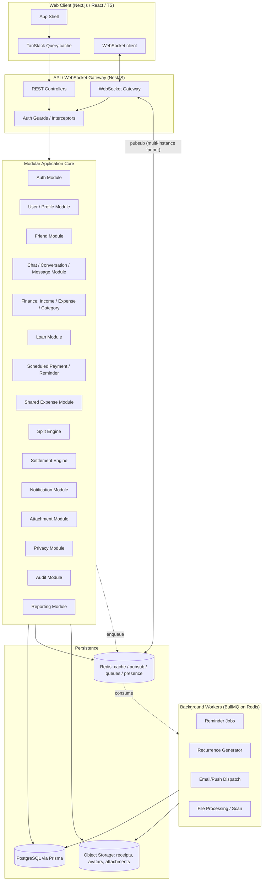
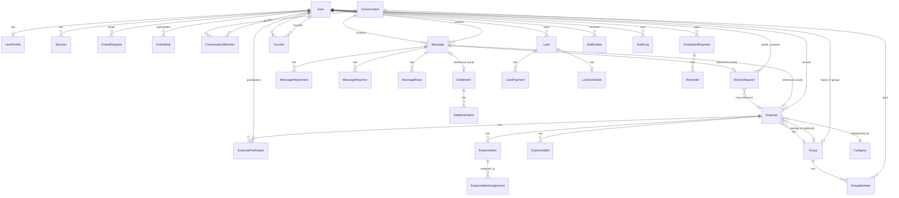

# Finance + Friends + Chat — Technical Blueprint

Status: **Phase 1 and Phase 2 implemented.** See §19 for what Phase 2 shipped
and where it deliberately narrowed the stub in §6/§9 below.

This document is the single source of truth for architecture, data model, financial
rules, API contracts, and the security model. It corresponds to Section 53 of the
master spec. Nothing in Phase 1 gets implemented until this is reviewed.

---

## 1. Architecture Diagram



Key architectural decisions:

- **Modular monolith** (NestJS modules with hard boundaries), not microservices. Each
  module exposes a service interface; other modules depend on the service, never on
  another module's repository/Prisma models directly. This keeps a future extraction
  to services possible without a rewrite.
- **Redis** is the single shared backbone for: query cache, WebSocket pub/sub fanout
  (multi-instance chat), presence/typing ephemeral state, and BullMQ job queues.
- **Object storage** is abstracted behind a `StorageProvider` interface (local disk
  adapter for dev via Docker volume, S3-compatible adapter for prod).
- Business logic (split math, balance derivation, settlement) lives in pure,
  framework-agnostic service classes/functions so it is unit-testable without
  spinning up Nest's DI container or a database.

---

## 2. Feature List (condensed — full detail in spec sections 1–2, 5–27)

| Domain | Features |
|---|---|
| Auth | register, login, logout, email verify, forgot/reset/change password, sessions, device mgmt, optional 2FA (TOTP), account deletion, data export |
| Profile | username, display name, avatar, bio, presence, granular privacy settings |
| Friends | search, request/accept/reject/cancel, remove, block/unblock, list, profile view |
| Chat | 1:1 + group conversations, text/image/file/voice, replies, reactions, edit/delete, read receipts, delivered, typing, presence, unread counts, search, mute/archive, block/report |
| Personal finance | income (incl. recurring), expenses, custom categories, attachments |
| Scheduled payments | recurring/one-off future payments, reminder schedules, auto-roll to next occurrence |
| Loans | owed-by-me and owed-to-me, principal/interest/installments, payment history |
| Shared expenses | equal / exact / percentage / shares / item-based splits, participants, group expenses |
| Balances | per-friend derived net balance, always computed from immutable events |
| Settlement | request, record (full/partial), history, debt-simplification optimizer |
| Money requests | create, pay/decline, becomes a financial event on response |
| Chat + finance integration | structured expense/request/settlement message cards |
| Forecasting | projected balance from scheduled items, explicitly labeled as an estimate |
| Notifications | in-app, browser push, email; per-type user preferences |
| Privacy | per-object visibility policy, enforced server-side only |
| Reporting | income/expense/category/loan/friend-balance reports, CSV/PDF export (later) |
| Security/Audit | Argon2, rate limiting, object-level authz, audit log for sensitive actions |

---

## 3. User Journeys (representative)

**A. Onboarding**
Register → verify email → choose username → display name → currency → (optional)
categories → (optional) first income → (optional) first scheduled payment → find
friends → dashboard.

**B. Split a dinner bill**
Open chat with group → `+` → Create expense → enter amount, payer, participants →
choose split method → system validates shares sum to total (integer minor units) →
expense posted as a structured card in chat → each participant's derived balance
updates → participants can tap "View Expense" for the breakdown.

**C. Settle up**
Friend balance screen → see net "You owe John Rs. 1,000" (derived from all expense
+ settlement events) → "Record payment" → full or partial amount → settlement event
created → balance re-derived → history retains original expenses untouched.

**D. Money request over chat**
In 1:1 chat → `+` → Request money → amount + reason + due date → recipient sees
card with Pay / Decline / View Details → recipient's action creates a financial
event (payment or decline) → sender notified in real time via WebSocket.

**E. Scheduled payment reminder**
User creates "Rent, Rs 40,000, monthly, due 25th" with 3-day and 1-day reminders →
BullMQ job scheduled → reminder fires as in-app + optional email notification →
user marks paid → next month's occurrence auto-generated with status `upcoming`.

---

## 4. Page / Screen Map

```
/                          → redirect (auth) or marketing/login
/login  /register  /verify-email  /forgot-password  /reset-password
/onboarding/{step}

/dashboard                 → financial summary, cash-flow, upcoming, recent
/income                    → list + create/edit
/expenses                  → list + create/edit
/scheduled-payments        → list + create/edit, status pipeline
/loans                     → list, detail (payments, schedule)
/reports                   → category/monthly/loan/cashflow reports

/friends                   → list, requests (incoming/outgoing), search
/friends/[username]        → public profile + shared balance summary (if shared)

/chat                      → conversation list (mobile: full-screen nav)
/chat/[conversationId]     → message thread, composer, finance cards inline

/groups                    → list
/groups/[groupId]          → members, group expenses, group balance, group chat

/expenses/shared/[id]      → shared expense detail, item/participant breakdown
/balances                  → all friend balances overview
/balances/[friendId]       → event-by-event derivation ("why do I owe this")
/money-requests            → sent/received
/settlements/[friendId]    → settlement dialog + history

/settings/profile
/settings/privacy
/settings/notifications
/settings/security          → sessions/devices, 2FA, password
/settings/categories
```

Responsive behavior per spec §32: sidebar (desktop) → collapsible sidebar (tablet)
→ bottom nav + full-screen chat (mobile). Tables → cards on small screens.

---

## 5. Database ERD



Full attribute-level schema is in Section 6 (Prisma).

---

## 6. Database Schema (Prisma)

Design rules applied throughout:
- All externally-exposed IDs are `cuid()` (non-sequential, unguessable) — not
  auto-increment integers.
- **All monetary amounts are stored as `BigInt` minor units** (e.g. paise/cents),
  never `Float`. A `currency` (ISO 4217) column sits next to every amount.
- Soft delete (`deletedAt`) on entities that have a legal/financial paper trail
  (Expense, Income, Loan, Settlement, MoneyRequest) — never hard-deleted, per the
  "never destroy the audit trail" rule (spec §57). Hard delete is fine for
  ephemeral things (typing state, sessions on logout).
- Every table has `createdAt` / `updatedAt`.

```prisma
// schema.prisma (excerpt — Phase 1 models fully shown; Phase 2/3 models stubbed
// with full field lists so the ERD is complete, but they are not migrated until
// their phase begins)

generator client {
  provider = "prisma-client-js"
}

datasource db {
  provider = "postgresql"
  url      = env("DATABASE_URL")
}

/// ---------- AUTH / USER (Phase 1) ----------

model User {
  id            String    @id @default(cuid())
  email         String    @unique
  emailVerified Boolean   @default(false)
  passwordHash  String
  username      String    @unique // stored lowercase; display case kept separately
  usernameDisplay String
  status        UserStatus @default(ACTIVE)
  createdAt     DateTime  @default(now())
  updatedAt     DateTime  @updatedAt
  deletedAt     DateTime?

  profile           UserProfile?
  sessions          Session[]
  twoFactor         TwoFactorSecret?
  sentFriendReqs    FriendRequest[]      @relation("FriendRequestSender")
  recvFriendReqs    FriendRequest[]      @relation("FriendRequestReceiver")
  friendshipsA      Friendship[]         @relation("FriendshipUserA")
  friendshipsB      Friendship[]         @relation("FriendshipUserB")
  categories        Category[]
  incomes           Income[]
  expensesPaid      Expense[]            @relation("ExpensePayer")
  expenseParticipations ExpenseParticipant[]
  loans             Loan[]
  scheduledPayments ScheduledPayment[]
  conversationMembers ConversationMember[]
  messages          Message[]
  groupMemberships  GroupMember[]
  moneyRequestsSent MoneyRequest[]       @relation("MoneyRequestSender")
  moneyRequestsRecv MoneyRequest[]       @relation("MoneyRequestReceiver")
  settlementsPaid   Settlement[]         @relation("SettlementPayer")
  settlementsRecv   Settlement[]         @relation("SettlementReceiver")
  notifications     Notification[]
  auditLogs         AuditLog[]

  @@index([username])
}

enum UserStatus {
  ACTIVE
  SUSPENDED
  DEACTIVATED
}

model UserProfile {
  userId       String   @id
  user         User     @relation(fields: [userId], references: [id])
  displayName  String
  avatarUrl    String?
  bio          String?
  defaultCurrency String @default("LKR")
  timezone     String   @default("UTC")

  whoCanFriendRequest  VisibilityAudience @default(EVERYONE)
  whoCanMessage        VisibilityAudience @default(FRIENDS)
  whoCanSeeProfile     VisibilityAudience @default(EVERYONE)
  whoCanAddToGroups    VisibilityAudience @default(FRIENDS)

  updatedAt DateTime @updatedAt
}

enum VisibilityAudience {
  EVERYONE
  FRIENDS
  NOBODY
}

model Session {
  id           String   @id @default(cuid())
  userId       String
  user         User     @relation(fields: [userId], references: [id])
  refreshTokenHash String
  userAgent    String?
  ipAddress    String?
  deviceLabel  String?
  createdAt    DateTime @default(now())
  lastUsedAt   DateTime @default(now())
  expiresAt    DateTime
  revokedAt    DateTime?

  @@index([userId])
}

model TwoFactorSecret {
  userId      String  @id
  user        User    @relation(fields: [userId], references: [id])
  secretEnc   String  // encrypted at rest (KMS/env key), not plaintext
  enabled     Boolean @default(false)
  recoveryCodesHash String[] // hashed, one-time use
}

/// ---------- FRIENDS (Phase 2) ----------

model FriendRequest {
  id          String   @id @default(cuid())
  senderId    String
  sender      User     @relation("FriendRequestSender", fields: [senderId], references: [id])
  receiverId  String
  receiver    User     @relation("FriendRequestReceiver", fields: [receiverId], references: [id])
  status      FriendRequestStatus @default(PENDING)
  createdAt   DateTime @default(now())
  respondedAt DateTime?

  @@unique([senderId, receiverId])
  @@index([receiverId, status])
}

enum FriendRequestStatus {
  PENDING
  ACCEPTED
  REJECTED
  CANCELLED
}

model Friendship {
  id        String   @id @default(cuid())
  userAId   String   // userAId < userBId enforced in application layer (canonical ordering)
  userA     User     @relation("FriendshipUserA", fields: [userAId], references: [id])
  userBId   String
  userB     User     @relation("FriendshipUserB", fields: [userBId], references: [id])
  blockedBy String?  // userId of blocker, null if not blocked
  createdAt DateTime @default(now())

  @@unique([userAId, userBId])
}

/// ---------- CHAT (Phase 2) ----------

model Conversation {
  id        String   @id @default(cuid())
  type      ConversationType
  groupId   String?  @unique
  group     Group?   @relation(fields: [groupId], references: [id])
  createdAt DateTime @default(now())

  members  ConversationMember[]
  messages Message[]
}

enum ConversationType {
  DIRECT
  GROUP
}

model ConversationMember {
  id             String   @id @default(cuid())
  conversationId String
  conversation   Conversation @relation(fields: [conversationId], references: [id])
  userId         String
  user           User     @relation(fields: [userId], references: [id])
  joinedAt       DateTime @default(now())
  mutedUntil     DateTime?
  archivedAt     DateTime?
  lastReadMessageId String?

  @@unique([conversationId, userId])
  @@index([userId])
}

model Message {
  id             String   @id @default(cuid())
  conversationId String
  conversation   Conversation @relation(fields: [conversationId], references: [id])
  senderId       String
  sender         User     @relation(fields: [senderId], references: [id])
  type           MessageType @default(TEXT)
  body           String?
  replyToId      String?
  expenseCardId  String?  // FK to Expense when type=EXPENSE_CARD
  moneyRequestCardId String? // FK to MoneyRequest when type=MONEY_REQUEST_CARD
  settlementCardId String? // FK to Settlement when type=SETTLEMENT_CARD
  editedAt       DateTime?
  deletedAt      DateTime?
  createdAt      DateTime @default(now())

  attachments MessageAttachment[]
  reactions   MessageReaction[]
  reads       MessageRead[]

  @@index([conversationId, createdAt])
}

enum MessageType {
  TEXT
  IMAGE
  FILE
  VOICE
  EXPENSE_CARD
  MONEY_REQUEST_CARD
  SETTLEMENT_CARD
  SYSTEM
}

model MessageAttachment {
  id        String  @id @default(cuid())
  messageId String
  message   Message @relation(fields: [messageId], references: [id])
  url       String
  mimeType  String
  sizeBytes Int
  width     Int?
  height    Int?
}

model MessageReaction {
  id        String   @id @default(cuid())
  messageId String
  message   Message  @relation(fields: [messageId], references: [id])
  userId    String
  emoji     String
  createdAt DateTime @default(now())

  @@unique([messageId, userId, emoji])
}

model MessageRead {
  messageId String
  message   Message @relation(fields: [messageId], references: [id])
  userId    String
  readAt    DateTime @default(now())

  @@id([messageId, userId])
}

/// ---------- PERSONAL FINANCE (Phase 1) ----------

model Category {
  id       String   @id @default(cuid())
  userId   String
  user     User     @relation(fields: [userId], references: [id])
  name     String
  kind     CategoryKind
  icon     String?
  isSystemDefault Boolean @default(false)
  archivedAt DateTime?

  @@unique([userId, name, kind])
}

enum CategoryKind {
  INCOME
  EXPENSE
}

model Income {
  id            String   @id @default(cuid())
  userId        String
  user          User     @relation(fields: [userId], references: [id])
  amountMinor   BigInt
  currency      String
  categoryId    String?
  source        String
  description   String?
  date          DateTime
  isRecurring   Boolean  @default(false)
  recurrenceRule String? // RFC-5545 RRULE subset
  attachmentUrl String?
  notes         String?
  createdAt     DateTime @default(now())
  updatedAt     DateTime @updatedAt
  deletedAt     DateTime?

  @@index([userId, date])
}

model Expense {
  id            String   @id @default(cuid())
  ownerId       String   // who recorded it in their books
  owner         User     @relation(fields: [ownerId], references: [id])
  payerId       String   // who actually paid
  payer         User     @relation("ExpensePayer", fields: [payerId], references: [id])
  amountMinor   BigInt
  currency      String
  categoryId    String?
  merchant      String?
  description   String?
  date          DateTime
  paymentMethod String?
  attachmentUrl String?
  notes         String?
  splitMethod   SplitMethod @default(NONE) // NONE = purely personal expense
  visibility    Visibility  @default(PRIVATE)
  groupId       String?
  group         Group?      @relation(fields: [groupId], references: [id])
  createdAt     DateTime @default(now())
  updatedAt     DateTime @updatedAt
  deletedAt     DateTime?

  participants ExpenseParticipant[]
  splits       ExpenseSplit[]
  items        ExpenseItem[]

  @@index([ownerId, date])
  @@index([payerId])
  @@index([groupId])
}

enum SplitMethod {
  NONE
  EQUAL
  EXACT
  PERCENTAGE
  SHARES
  ITEMS
}

enum Visibility {
  PRIVATE
  SHARED_WITH_USERS
  SHARED_WITH_GROUP
  PARTICIPANTS_ONLY
}

model ExpenseParticipant {
  id        String  @id @default(cuid())
  expenseId String
  expense   Expense @relation(fields: [expenseId], references: [id])
  userId    String
  user      User    @relation(fields: [userId], references: [id])

  @@unique([expenseId, userId])
}

/// One immutable row per participant: their computed owed amount for this expense.
/// This is the ledger leaf-level fact the balance engine reads — never overwritten,
/// only ever superseded by a new Expense version (edits create audit trail, see §57).
model ExpenseSplit {
  id             String  @id @default(cuid())
  expenseId      String
  expense        Expense @relation(fields: [expenseId], references: [id])
  userId         String
  shareMinor     BigInt   // this participant's responsibility, in minor units
  percentageBps  Int?     // basis points (1/100 of a percent) if PERCENTAGE method
  shareUnits     Int?     // raw share count if SHARES method
  createdAt      DateTime @default(now())

  @@unique([expenseId, userId])
}

model ExpenseItem {
  id          String  @id @default(cuid())
  expenseId   String
  expense     Expense @relation(fields: [expenseId], references: [id])
  name        String
  amountMinor BigInt

  assignments ExpenseItemAssignment[]
}

model ExpenseItemAssignment {
  id            String      @id @default(cuid())
  expenseItemId String
  expenseItem   ExpenseItem @relation(fields: [expenseItemId], references: [id])
  userId        String
  weight        Int @default(1) // supports "everyone splits dessert" via equal weight

  @@unique([expenseItemId, userId])
}

/// ---------- LOANS (Phase 1) ----------

model Loan {
  id              String   @id @default(cuid())
  userId          String
  user            User     @relation(fields: [userId], references: [id])
  direction       LoanDirection // I_OWE | OWED_TO_ME
  counterpartyName String       // free text if not a platform user (e.g. "Bank")
  counterpartyUserId String?    // set if the lender/borrower is a friend
  principalMinor  BigInt
  currency        String
  interestRateBps Int?          // annual, basis points
  startDate       DateTime
  status          LoanStatus @default(ACTIVE)
  notes           String?
  createdAt       DateTime @default(now())
  updatedAt       DateTime @updatedAt
  deletedAt       DateTime?

  schedule LoanSchedule?
  payments LoanPayment[]

  @@index([userId, status])
}

enum LoanDirection {
  I_OWE
  OWED_TO_ME
}

enum LoanStatus {
  ACTIVE
  PAID_OFF
  DEFAULTED
  CANCELLED
}

model LoanSchedule {
  loanId            String   @id
  loan              Loan     @relation(fields: [loanId], references: [id])
  installmentMinor  BigInt
  frequency         RecurrenceFrequency
  nextDueDate       DateTime
}

model LoanPayment {
  id           String   @id @default(cuid())
  loanId       String
  loan         Loan     @relation(fields: [loanId], references: [id])
  amountMinor  BigInt
  date         DateTime
  method       String?
  reference    String?
  notes        String?
  createdAt    DateTime @default(now())

  @@index([loanId, date])
}

/// ---------- SCHEDULED PAYMENTS (Phase 1) ----------

model ScheduledPayment {
  id             String   @id @default(cuid())
  userId         String
  user           User     @relation(fields: [userId], references: [id])
  name           String
  amountMinor    BigInt
  currency       String
  categoryId     String?
  dueDate        DateTime
  recurrence     RecurrenceFrequency @default(NONE)
  status         ScheduledPaymentStatus @default(UPCOMING)
  notes          String?
  parentSeriesId String?  // links generated occurrences of a recurring series
  createdAt      DateTime @default(now())
  updatedAt      DateTime @updatedAt
  deletedAt      DateTime?

  reminders Reminder[]

  @@index([userId, dueDate])
  @@index([userId, status])
}

enum RecurrenceFrequency {
  NONE
  DAILY
  WEEKLY
  MONTHLY
  YEARLY
}

enum ScheduledPaymentStatus {
  UPCOMING
  DUE
  PAID
  OVERDUE
  CANCELLED
}

model Reminder {
  id                 String   @id @default(cuid())
  scheduledPaymentId String
  scheduledPayment   ScheduledPayment @relation(fields: [scheduledPaymentId], references: [id])
  offsetDays         Int      // e.g. 7, 3, 1, 0
  firedAt            DateTime?
}

/// ---------- GROUPS (Phase 3) ----------

model Group {
  id        String   @id @default(cuid())
  name      String
  avatarUrl String?
  createdById String
  createdAt DateTime @default(now())
  archivedAt DateTime?

  members      GroupMember[]
  expenses     Expense[]
  conversation Conversation?
}

model GroupMember {
  id       String   @id @default(cuid())
  groupId  String
  group    Group    @relation(fields: [groupId], references: [id])
  userId   String
  user     User     @relation(fields: [userId], references: [id])
  role     GroupRole @default(MEMBER)
  joinedAt DateTime @default(now())

  @@unique([groupId, userId])
}

enum GroupRole {
  OWNER
  ADMIN
  MEMBER
}

/// ---------- MONEY REQUESTS / SETTLEMENTS (Phase 3) ----------

model MoneyRequest {
  id          String   @id @default(cuid())
  senderId    String   // requester (who is owed)
  sender      User     @relation("MoneyRequestSender", fields: [senderId], references: [id])
  receiverId  String   // who is being asked to pay
  receiver    User     @relation("MoneyRequestReceiver", fields: [receiverId], references: [id])
  amountMinor BigInt
  currency    String
  reason      String
  dueDate     DateTime?
  relatedExpenseId String?
  status      MoneyRequestStatus @default(PENDING)
  createdAt   DateTime @default(now())
  respondedAt DateTime?
  deletedAt   DateTime?

  @@index([receiverId, status])
  @@index([senderId, status])
}

enum MoneyRequestStatus {
  PENDING
  PAID
  DECLINED
  CANCELLED
}

/// A settlement is a financial event between two users, independent of any single
/// expense. It never mutates past Expense/ExpenseSplit rows.
model Settlement {
  id          String   @id @default(cuid())
  payerId     String   // who is paying
  payer       User     @relation("SettlementPayer", fields: [payerId], references: [id])
  receiverId  String   // who is receiving
  receiver    User     @relation("SettlementReceiver", fields: [receiverId], references: [id])
  amountMinor BigInt
  currency    String
  method      String?
  reference   String?
  notes       String?
  createdAt   DateTime @default(now())
  deletedAt   DateTime?

  items SettlementItem[]

  @@index([payerId, receiverId])
}

/// Optional: which specific expenses/requests a settlement is allocated against,
/// for full traceability ("this Rs 2000 payment cleared the dinner + coffee tabs").
model SettlementItem {
  id             String     @id @default(cuid())
  settlementId   String
  settlement     Settlement @relation(fields: [settlementId], references: [id])
  expenseId      String?
  allocatedMinor BigInt
}

/// ---------- NOTIFICATIONS / AUDIT (all phases) ----------

model Notification {
  id        String   @id @default(cuid())
  userId    String
  user      User     @relation(fields: [userId], references: [id])
  type      NotificationType
  payload   Json
  readAt    DateTime?
  createdAt DateTime @default(now())

  @@index([userId, readAt])
}

enum NotificationType {
  FRIEND_REQUEST
  FRIEND_REQUEST_ACCEPTED
  NEW_MESSAGE
  MENTION
  EXPENSE_CREATED
  EXPENSE_UPDATED
  MONEY_REQUEST
  PAYMENT_RECEIVED
  PAYMENT_DUE
  PAYMENT_OVERDUE
  LOAN_REMINDER
  GROUP_INVITATION
  SETTLEMENT_REQUEST
  SETTLEMENT_COMPLETED
}

model AuditLog {
  id         String   @id @default(cuid())
  actorId    String?
  actor      User?    @relation(fields: [actorId], references: [id])
  action     String   // e.g. "expense.created", "friend.blocked"
  resourceType String
  resourceId String
  metadata   Json?
  ipAddress  String?
  userAgent  String?
  createdAt  DateTime @default(now())

  @@index([resourceType, resourceId])
  @@index([actorId, createdAt])
}
```

---

## 7. API Specification (Phase 1 shown in full; Phase 2/3 as summary — detailed
specs written when each phase starts)

Conventions: JSON:API-ish plain REST, `Authorization: Bearer <accessToken>`,
cursor pagination (`?cursor=&limit=`), errors as
`{ "error": { "code": "EXPENSE_SPLIT_MISMATCH", "message": "..." } }`.

### Phase 1 endpoints

```
POST   /auth/register
POST   /auth/login
POST   /auth/logout
POST   /auth/refresh
POST   /auth/verify-email
POST   /auth/forgot-password
POST   /auth/reset-password
POST   /auth/change-password
GET    /auth/sessions
DELETE /auth/sessions/:id
POST   /auth/2fa/enable
POST   /auth/2fa/verify
POST   /auth/2fa/disable

GET    /users/me
PATCH  /users/me
GET    /users/me/export             # account data export
DELETE /users/me                    # account deletion (soft, grace period)
GET    /users/check-username?u=...

GET    /categories
POST   /categories
PATCH  /categories/:id
DELETE /categories/:id

POST   /income
GET    /income
GET    /income/:id
PATCH  /income/:id
DELETE /income/:id

POST   /expenses                    # personal, splitMethod=NONE in Phase 1
GET    /expenses
GET    /expenses/:id
PATCH  /expenses/:id
DELETE /expenses/:id

POST   /loans
GET    /loans
GET    /loans/:id
POST   /loans/:id/payments
GET    /loans/:id/payments

POST   /scheduled-payments
GET    /scheduled-payments
PATCH  /scheduled-payments/:id
POST   /scheduled-payments/:id/mark-paid
DELETE /scheduled-payments/:id

GET    /dashboard/summary
GET    /reports/income
GET    /reports/expenses
GET    /reports/category-breakdown
GET    /reports/cash-flow

GET    /notifications
PATCH  /notifications/:id/read
GET    /notifications/preferences
PATCH  /notifications/preferences
```

### Phase 2 endpoints (summary)
```
GET/POST /friends/requests, POST .../accept, .../reject, DELETE /friends/:id,
POST /friends/:id/block
GET/POST /conversations, GET /conversations/:id/messages,
POST /conversations/:id/messages, PATCH/DELETE /messages/:id,
POST /messages/:id/reactions, POST /conversations/:id/read
WS gateway: see §9
```

### Phase 3 endpoints (summary)
```
POST /expenses (splitMethod != NONE, participants[], splits[])
POST /expenses/:id/settle
GET  /balances, GET /balances/:friendId
POST /money-requests, POST /money-requests/:id/pay, .../decline
POST /settlements, GET /settlements/:friendId
POST /groups, GET /groups/:id, POST /groups/:id/members
GET  /groups/:id/balances
GET  /balances/optimize   # debt-simplification suggestion, read-only
```

Every write endpoint: Zod/class-validator DTO validation → guard checks
authentication → object-level authorization check (is this user allowed to touch
*this specific* resource, not just "is this user logged in") → service call →
audit log write for sensitive actions → response.

---

## 8. Authentication Architecture

- **Password hashing**: Argon2id, per-user random salt (library-managed), tuned
  cost params (target ~250ms on server hardware).
- **Session model**: short-lived JWT access token (15 min) + opaque refresh token
  stored server-side hashed in `Session` table, rotated on every refresh (refresh
  token reuse detection → revoke whole session family). Access token in memory on
  client; refresh token in an `HttpOnly`, `Secure`, `SameSite=Strict` cookie.
- **Email verification**: signed, time-boxed token emailed on registration.
  **Fully gated**: the account cannot log in or use the app at all until the link
  is clicked.
- **Password reset**: single-use, time-boxed token; invalidates all existing
  sessions on successful reset.
- **2FA**: TOTP (RFC 6238), secret encrypted at rest, one-time recovery codes
  (hashed, single-use).
- **Device/session management**: `/auth/sessions` lists active sessions with
  device/IP/last-used; user can revoke individually or "log out everywhere".
- **Rate limiting**: per-IP and per-account sliding window on
  login/register/password-reset (Redis-backed), exponential backoff on repeated
  failures, generic error messages (no username/email enumeration).
- **Authorization**: NestJS guards for authentication; a separate `PolicyGuard` /
  per-service ownership check for authorization, always re-verified server-side
  regardless of what the client claims.

---

## 9. WebSocket Architecture

- NestJS `@WebSocketGateway`, Socket.IO adapter, Redis adapter for multi-instance
  pub/sub fanout.
- Auth: access token passed at handshake (`auth: { token }`), validated before the
  connection is accepted; socket is bound to `userId`.
- Rooms: `user:{userId}` (personal notification channel), `conversation:{id}`
  (joined only after server verifies membership), `presence` (global, throttled).
- Client never joins a room by ID alone — server looks up membership from DB/Redis
  cache before allowing the join, every time.

Events:
```
message:new / message:updated / message:deleted / message:read
typing:start / typing:stop
presence:update
notification:new
expense:created / expense:updated / expense:settled
money-request:created / money-request:updated
friend-request:new / friend-request:accepted
```

Offline delivery: if the target user has no active socket, the event is persisted
(Notification row / Message row already is) and, per their notification
preferences, an email/push job is enqueued instead of being lost.

---

## 10. Financial Ledger Model

Core principle (spec §18, §57): **balances are never stored as a mutable number,
they are derived from an append-only sequence of events.**

Events that affect a friend-pair balance:
1. `ExpenseSplit` rows (created when an Expense is posted) — each row says
   "user X owes `shareMinor` toward this expense, paid by `payerId`".
2. `Settlement` rows — "payer paid receiver `amountMinor`".

Derivation for `balance(A, B)`:
```
owedByAtoB = Σ ExpenseSplit.shareMinor
             WHERE ExpenseSplit.userId = A
               AND Expense.payerId = B
               AND Expense not deleted
           + Σ Settlement.amountMinor WHERE payerId = A AND receiverId = B   -- reduces what A owes B... 
```
More precisely, using signed net convention (positive = counterparty owes *you*):
```
net(A, B) =
    Σ splits where participant=A, payer=B, sign = -1   (A owes B)
  + Σ splits where participant=B, payer=A, sign = +1   (B owes A → A is owed)
  + Σ settlements paid A→B, sign = +1 (reduces A's debt, i.e. increases net for A)
  - Σ settlements paid B→A, sign = -1
```
This is computed with a single indexed SQL aggregation, not iteration in app code,
and is always consistent because it's a pure function of immutable rows. Edits to
an Expense do not mutate `ExpenseSplit` rows in place — they close out the old
splits (soft-delete the Expense version) and create a new Expense + new splits, so
the event history stays intact and explainable (spec §57's "why do I owe this"
requirement is answered by literally listing the contributing rows).

A materialized/cached balance (Redis or a `FriendBalanceCache` table) MAY be kept
for read performance, but it is always a cache invalidated/recomputed from the
event tables — never the source of truth.

---

## 11. Expense Splitting Algorithm

All amounts are `BigInt` minor units. No floating point anywhere in this path.

**Equal split** (`n` participants, total `T`):
```
base = T div n
remainder = T mod n
// distribute the remainder 1 minor-unit at a time to the first `remainder`
// participants (deterministic order = participant creation order / userId asc)
// so Σ shares === T exactly, always.
shares[i] = base + (i < remainder ? 1 : 0)
```

**Exact amount split**: caller supplies `shareMinor` per participant.
Validate `Σ shareMinor === T` exactly, reject otherwise
(`EXPENSE_SPLIT_MISMATCH`, no silent correction).

**Percentage split**: caller supplies basis points per participant
(`Σ bps === 10000`). Compute `share = floor(T * bps / 10000)`, then distribute the
rounding remainder (`T - Σ shares`) one minor unit at a time to the participants
with the largest fractional remainder (largest-remainder method) — this is the
standard apportionment algorithm and guarantees Σ shares === T with minimal bias.

**Shares split**: caller supplies integer share units per participant (e.g. 2:1:1).
`share_i = floor(T * units_i / Σunits)`, remainder distributed by the same
largest-remainder method as percentage.

**Item-based split**: each `ExpenseItem.amountMinor` is split among its assigned
participants using the *equal-split remainder algorithm* above (weighted by
`ExpenseItemAssignment.weight` for cases like "dessert split among everyone
equally weighted"). Each participant's final `ExpenseSplit.shareMinor` is the sum
of their assignments across all items. Validate `Σ item.amountMinor === T`
up front.

Every split method funnels through one invariant check before persisting:
`Σ ExpenseSplit.shareMinor === Expense.amountMinor`, enforced in the service layer
and backed by a DB check via a deferred trigger or transaction-time assertion —
never allow a partially-written invalid state.

---

## 12. Settlement Algorithm

- **Recording a settlement**: creates a `Settlement` row (payer→receiver, amount).
  Does not touch existing `Expense`/`ExpenseSplit` rows. Net balance is
  re-derived (§10) — if it reaches exactly 0, UI shows "Settled up"; it is not a
  separate boolean flag that can drift from reality.
- **Partial settlement**: same mechanism, just `amountMinor < outstanding`. Balance
  after = outstanding - amountMinor, computed, not stored.
- **Optimized settlement (debt simplification)**, read-only suggestion generator:
  1. Compute net balance per user within the scope (a group, or a friend circle).
  2. Split users into creditors (net positive) and debtors (net negative).
  3. Greedy min-transfer algorithm: repeatedly match the largest creditor with the
     largest debtor, transfer `min(|creditor|, |debtor|)`, reduce both, repeat
     until all near zero. This minimizes transfer count (not provably optimal in
     the general case but standard practice and good enough — documented as such).
  4. Output is a list of suggested `{from, to, amount}` transfers. Never
     auto-applied — user must explicitly record each as a real `Settlement`.

---

## 13. Privacy Model

```
enum Visibility { PRIVATE, SHARED_WITH_USERS, SHARED_WITH_GROUP, PARTICIPANTS_ONLY }
```
- Default for all personal finance objects (Income, personal Expense, Loan,
  ScheduledPayment): `PRIVATE` — visible only to the owning `userId`. Full stop,
  no exceptions, checked in every service method via `WHERE ownerId = currentUserId`.
- Default for a shared Expense: `PARTICIPANTS_ONLY` — visible only to rows in
  `ExpenseParticipant` for that expense (payer is implicitly a participant).
- `SHARED_WITH_GROUP`: visible to `GroupMember` of the expense's `groupId`.
- `SHARED_WITH_USERS`: explicit allow-list (future extension point; not needed
  for Phase 3's core participant model but reserved in the enum).
- **Enforced exclusively server-side.** Every read query for a finance object is
  scoped by a policy predicate function (`buildVisibilityWhere(userId, resource)`)
  applied at the Prisma query layer — there is no code path that returns finance
  rows without passing through it. Frontend hides UI for UX only; it is never the
  security boundary (spec §2, §28, §29).
- Friendship ≠ financial access. Accepting a friend request grants chat/social
  visibility per profile settings only; it grants zero implicit access to any
  Income/Expense/Loan row.

---

## 14. Notification Architecture

- All notification-worthy events write a `Notification` row synchronously (fast,
  in the request path) and emit a `notification:new` WebSocket event to
  `user:{userId}` if connected.
- Email/push delivery is **never done inline in the HTTP request** — the request
  handler enqueues a BullMQ job (`notify.email`, `notify.push`) and returns. A
  worker consumes the queue, checks the user's `NotificationPreference` for that
  `type` + channel before sending, and applies basic debouncing (e.g. don't email
  more than once per N minutes for the same conversation) to avoid spam per §13
  of the spec.
- Preferences are per-`NotificationType` × per-channel (`in_app`, `email`, `push`)
  boolean matrix, defaults conservative (chat messages: in-app only by default;
  payment-due/overdue: in-app + email by default).

---

## 15. Folder Structure

```
finance/
├── docs/
│   └── BLUEPRINT.md                 (this file)
├── apps/
│   ├── api/                         # NestJS backend
│   │   ├── src/
│   │   │   ├── modules/
│   │   │   │   ├── auth/
│   │   │   │   ├── user/
│   │   │   │   ├── friend/
│   │   │   │   ├── chat/
│   │   │   │   ├── finance/
│   │   │   │   │   ├── income/
│   │   │   │   │   ├── expense/
│   │   │   │   │   ├── category/
│   │   │   │   │   ├── split-engine/       # pure functions, framework-agnostic
│   │   │   │   │   └── settlement-engine/  # pure functions, framework-agnostic
│   │   │   │   ├── loan/
│   │   │   │   ├── scheduled-payment/
│   │   │   │   ├── group/
│   │   │   │   ├── money-request/
│   │   │   │   ├── notification/
│   │   │   │   ├── file/
│   │   │   │   ├── privacy/
│   │   │   │   └── audit/
│   │   │   ├── common/               # guards, interceptors, decorators, filters
│   │   │   ├── websocket/            # gateway, room auth
│   │   │   ├── jobs/                 # BullMQ processors
│   │   │   ├── prisma/
│   │   │   └── main.ts
│   │   ├── prisma/
│   │   │   ├── schema.prisma
│   │   │   └── migrations/
│   │   └── test/
│   └── web/                          # Next.js frontend
│       ├── app/                      # route segments matching §4 page map
│       ├── components/
│       │   ├── ui/                   # design system primitives (§42)
│       │   ├── dashboard/            (§43)
│       │   ├── chat/                 (§44)
│       │   └── finance/              (§45)
│       ├── lib/                      # api client, zod schemas, query hooks
│       └── test/
├── packages/
│   └── shared/                       # shared TS types/DTOs/zod schemas used by
│                                      # both apps (single source of truth for
│                                      # request/response shapes)
├── docker-compose.yml                # postgres, redis, api, web (uploads on a local disk volume in dev)
└── package.json                      # pnpm workspace root
```

---

## 16. Phase 1 Implementation Plan

Matches spec §54, sequenced as concrete work items:

1. pnpm workspace scaffold (`apps/api`, `apps/web`, `packages/shared`)
2. `docker-compose.yml`: postgres, redis (file uploads go to a local disk volume
   behind the `StorageProvider` interface in dev; swappable for S3-compatible
   storage in production without touching calling code)
3. Prisma init against Phase 1 subset of schema in §6 (User, UserProfile, Session,
   TwoFactorSecret, Category, Income, Expense — personal-only, Loan,
   ScheduledPayment, Reminder, Notification, AuditLog)
4. Initial migration + seed script (system default categories)
5. NestJS app bootstrap: config module (env validation via Zod), Prisma module,
   global exception filter, global validation pipe
6. Auth module: register, login, logout, refresh, **email verification (fully
   gates login until verified)**, password reset, Argon2 hashing, session table,
   rate limiting, and the **full 2FA (TOTP) flow**: enroll with QR code, verify,
   hashed one-time recovery codes, enable/disable endpoints
7. User/profile module: `/users/me`, username availability check + validation
8. Authorization guards + `PolicyGuard` scaffold (used from Phase 1 on so the
   pattern is established before finance/chat modules multiply it)
9. Category module (CRUD, system defaults seeded per new user)
10. Income module (CRUD, recurring flag)
11. Expense module (CRUD, personal-only `splitMethod=NONE` for now)
12. Scheduled payment module + Reminder sub-resource + BullMQ reminder job
13. Loan module (CRUD + payments)
14. Dashboard summary endpoint (aggregation queries)
15. Reports endpoints (category breakdown, income vs expense, cash flow)
16. Frontend: auth pages, onboarding flow, dashboard, income/expense/loan/
    scheduled-payment CRUD screens, design system primitives
17. Unit tests: split-engine placeholder (real tests land in Phase 3), auth flows,
    category/income/expense services
18. Integration tests: auth end-to-end, CRUD authorization (user A cannot read/
    write user B's rows)
19. Security review pass (§29/§52 checklist scoped to what exists)
20. UX review pass (empty states, loading states, responsive check)

I will implement this phase in the ordered sub-steps above, each as its own
reviewable increment (schema → backend → frontend → tests), not as one giant
commit.

---

## 17. Testing Strategy

- **Unit tests** (Jest): pure business logic first-class — split engine (all 5
  methods incl. rounding/remainder edge cases), balance derivation, settlement
  math, recurrence date generation. These run with no DB.
- **Integration tests**: NestJS testing module + a real Postgres test database
  (docker), covering service-level authorization (cross-user access denial),
  Prisma query correctness, transactional integrity of split writes.
- **API tests**: supertest against a running app instance — request/response
  contract, validation error shapes, auth guard behavior.
- **E2E tests** (Playwright, later phase): golden-path journeys from §3.
- Mandatory cases before the financial engine is considered done (spec §38):
  equal split remainder distribution, percentage split with largest-remainder
  rounding, exact split validation, friend balance netting across multiple
  expenses in both directions, partial then full settlement, group expenses,
  currency-mismatch rejection, concurrent-write race on the same expense
  (optimistic locking / transaction isolation test).

---

## 18. Security Threat Model (condensed STRIDE pass)

| Threat | Mitigation |
|---|---|
| Spoofing identity | Argon2id passwords, rate-limited login, optional 2FA, session-bound refresh tokens with reuse detection |
| Tampering with financial data | Server-side-only authorization on every write; DB-level constraints (amounts non-negative, split sum invariant); audit log on all mutations |
| Repudiation | Immutable event model (§10) + AuditLog with actor/timestamp/resource on every sensitive action |
| Information disclosure — cross-user finance leakage | Privacy model §13 enforced at query layer; object-level authorization tests are mandatory CI gates, not optional |
| Information disclosure — chat | Room join requires server-verified `ConversationMember` row; WS auth on handshake |
| Denial of service | Rate limiting (Redis sliding window) on auth + write-heavy endpoints; pagination everywhere; background jobs for expensive work |
| Elevation of privilege | Group roles (`OWNER/ADMIN/MEMBER`) checked server-side for group-mutating actions; no client-trusted role claims |
| Injection (SQLi) | Prisma parameterized queries exclusively; no raw string-interpolated SQL |
| XSS | React auto-escaping; strict CSP; sanitize any rendered user HTML (none planned — messages render as text/structured cards, not raw HTML) |
| CSRF | Refresh token cookie is `SameSite=Strict` + `HttpOnly`; state-changing requests require the bearer access token (not solely cookie-authenticated), which CSRF cannot forge |
| Insecure file upload | MIME allow-list, size limits, re-encode images server-side, virus-scan hook in the file pipeline (ClamAV or provider API) before an upload is marked usable, object storage keys are unguessable, never trust client-provided content-type alone |
| Secrets management | `.env` for dev only, never committed (`.gitignore`), production secrets via platform secret manager, `TwoFactorSecret` encrypted at rest |
| Session security | Short-lived access tokens, rotating refresh tokens, revocation list check, device/session management UI |
| Money/precision bugs | BigInt minor units everywhere, no `Float`/`Number` in the money path, explicit invariant checks before persisting splits |
| Race conditions on shared balances | Writes to Expense+ExpenseSplit happen inside a single DB transaction; balance reads are derived (no cached-value races); settlement recording is transactional |

---

## Decisions (confirmed with user 2026-08-18)

1. **Email verification**: **fully gated** — an account cannot log in or use the
   app at all until the email link is clicked.
2. **Default currency**: **LKR** (Sri Lankan Rupee), per-user overridable at
   onboarding as already designed. `UserProfile.defaultCurrency` default set to
   `"LKR"` in §6.
3. **Dev file storage**: **local disk only** — no MinIO/Docker container for
   storage in dev. The `StorageProvider` interface (§1) is still used so a real
   S3-compatible adapter can be swapped in for production without touching
   calling code. This choice is unrelated to hosting or mobile support: the app
   is a responsive website (§32, already mandatory regardless of this dev-only
   detail) and can be deployed to any host later.
4. **2FA**: **full TOTP flow (enroll with QR code, verify, hashed one-time
   recovery codes, enable/disable) ships in Phase 1**, not deferred. Phase 1 plan
   (§16) step 6 updated accordingly.
5. **Privacy, confirmed by user**: friends must never see income, salary, or
   private plans — they only see amounts tied to expenses actually shared with
   them (how much they owe the user, or are owed). This matches §2/§13 exactly as
   already designed; no change needed.

---

## 19. Phase 2 Implementation Notes (2026-08-19)

Shipped: friend requests (send/accept/reject/cancel), friendships, a dedicated
`Block` model (blocking works against a non-friend, not just to end an existing
friendship — see the model comment in §6), user search, direct-message chat
(text + one image/file attachment per message via the existing `/uploads`
endpoint, edit, soft-delete, read tracking), and an in-app notification feed
(`FRIEND_REQUEST`, `FRIEND_REQUEST_ACCEPTED`, `NEW_MESSAGE`) with an unread-count
bell in the nav. All object-level authorization follows the Phase 1 pattern —
every conversation/message/friend-request route re-checks membership or
ownership server-side, never trusting the client.

Deliberate scope reductions from the §6/§9 stub, each because the missing piece
only earns its keep once a later phase needs it:
- **No WebSocket gateway.** `socket.io`/`@nestjs/platform-socket.io` aren't
  reachable from this environment's npm registry (same class of issue as
  `@types/multer` in Phase 1 — see `apps/api/src/types/multer.d.ts`). The
  frontend polls instead (`apps/web/src/lib/hooks/use-chat.ts`,
  `use-notifications.ts`: ~3s while a conversation is open, ~8-15s for
  conversation/notification lists). Swap in the real gateway once the registry
  is reachable; the REST shape doesn't need to change.
- **DIRECT conversations only.** `ConversationType` dropped `GROUP` — group
  chat is tied to the `Group` model, which doesn't exist until Phase 3.
- **No `MessageAttachment`/`MessageRead` tables.** `attachmentUrl` lives
  directly on `Message` (one attachment per message), and read state is a
  single `lastReadAt` per `ConversationMember` instead of a row per message.
  Both only earn their keep once group chat needs "read by 3 of 5" or
  multi-attachment messages.
- **No notification preferences.** The Phase 1 API spec (§7) listed
  `GET/PATCH /notifications/preferences`, but there's only one channel
  actually implemented (in-app) — no push, no email digest — so a
  preferences model would have nothing to configure yet.

---

## 20. Phase 3 Implementation Notes (2026-08-19)

Shipped: shared expenses with all four non-itemized split methods (equal,
exact, percentage, shares — the split-engine math lives in
`packages/shared/src/split-engine.ts`, framework-agnostic and unit-tested
against the mandatory cases from §17: remainder distribution, largest-remainder
rounding, exact-amount mismatch rejection), groups (named containers for
shared expenses among friends), money requests (ask a friend to pay you, they
pay or decline), settlements (record a real payment either direction), the
interpersonal balance engine (`GET /balances`, `/balances/:friendId`, derived
per §10's signed-sum formula, never a stored/cached number), and debt
simplification (`GET /balances/optimize?groupId=`, the greedy largest-creditor/
largest-debtor match from §12).

`Expense.userId` was renamed to `ownerId` with a new `payerId` (equal to
`ownerId` for every pre-Phase-3 row — a hand-written migration, not Prisma's
default drop+recreate, so the rename didn't lose the 5 real rows already in
the dev database). `splitMethod=NONE` keeps behaving exactly as it did in
Phase 1: personal, `visibility=PRIVATE`, no participant/split rows.

A real bug worth recording: the first version of group balances/optimize
included *every* Settlement between two group members, not just settlements
related to that group's expenses — so a friend-to-friend settlement for an
unrelated direct expense silently zeroed out debt inside a group's balance
too. Fixed by dropping settlements from the group-scoped views entirely (see
the doc comment on `BalanceService.groupBalances`): a `Settlement` has no
group of its own — only an optional per-expense `SettlementItem` allocation
(see below) — so there's no reliable way to attribute a settlement to "this
group's tab" without it. The interpersonal `/balances` endpoints are unaffected
(they correctly net every expense and settlement between exactly two people,
group-originated or not).

Deliberate scope reductions, same rationale as §19 — the missing piece only
earns its keep once something later actually needs it:
- **No itemized (`ITEMS`) splitting.** Receipt-line-item assignment
  (`ExpenseItem`/`ExpenseItemAssignment` from the original §6 stub) needs its
  own UI for assigning individual items to people and wasn't built; `SplitMethod`
  only has `NONE`/`EQUAL`/`EXACT`/`PERCENTAGE`/`SHARES`.
- **`SettlementItem` allocation isn't wired up.** The model exists (per-expense
  traceability — "this payment cleared the dinner + coffee tabs") but
  `SettlementService.create` never writes one; every settlement is currently
  unallocated. This is also *why* group balances can't net settlements (above).
- **No group chat.** `Group` has no `Conversation` — group membership is a
  financial construct only this phase, consistent with Phase 2 also shipping
  DIRECT-only conversations.
- **`GroupRole` dropped `ADMIN`.** Only `OWNER`/`MEMBER` — the owner is the
  sole admin-equivalent (can remove members, cannot be removed themselves;
  archiving an owner-less group is the escape hatch, not a role transfer,
  which also isn't built).
- **The general expense list stays owner-only.** `GET /expenses` is unchanged
  from Phase 1; a participant's own shared expenses surface via
  `GET /expenses/shared-with-me` and the Balances/Groups pages instead of
  being interleaved into someone else's personal list.
- **Editing a shared expense's split isn't exposed in the UI yet**, though the
  API supports it (`PATCH /expenses/:id` replaces splits when `splitMethod` is
  resent) — the Expenses page's edit form only re-opens the plain fields.

---

## 21. Phase 4 Implementation Notes (2026-08-19)

Shipped: cash-flow forecasting (`GET /forecast?days=`) that projects a
starting balance forward through every recurring income/expense occurrence,
scheduled payment, and active loan installment expected to land within the
window, and per-loan payoff projections (`GET /forecast/loans/:loanId`) —
remaining balance after each future installment until it hits zero. Every
response carries `isEstimate: true` per the blueprint's own framing ("explicitly
labeled as an estimate"), and the frontend repeats the disclaimer visibly, not
just in the API shape. `occurrencesInWindow` (a new helper alongside
`nextOccurrence` in `recurrence.ts`) generates every occurrence of a recurring
series inside `[start, end]`, fast-forwarding past a series that began long
before the window instead of walking it occurrence-by-occurrence from origin.

Two real bugs found and fixed while browser-testing this feature (the e2e
suite had used precise `new Date().toISOString()` timestamps in its fixtures,
which don't reproduce what the actual `<input type="date">` forms submit —
a lesson now baked into the regression tests added for both):
- **A same-day item vanished from its own forecast.** The window's lower
  bound was `new Date()` (this exact instant), so a bill due "today" — stored
  as midnight UTC, since date inputs are date-only — read as already in the
  past the moment any time had elapsed since midnight. Fixed by using the
  *start of today* as the window boundary everywhere (`asOf` in the response
  still reports the real current instant).
- **A recurring income/expense's own recorded date was double-counted.**
  `startingBalanceMinor` already sums every recorded Income/Expense row
  (including ones dated today), so projecting that same row's date forward
  as a *future* event on top of the starting balance counted it twice. Fixed
  by projecting from `nextOccurrence(record.date, frequency)` — the first
  not-yet-recorded instance — not from the record's own date. This distinction
  doesn't apply to ScheduledPayment/LoanSchedule, whose `dueDate`/
  `nextDueDate` represent an *unpaid* obligation rather than something
  already recorded, so their own next-due date is correctly included.

Also added, since the feature was otherwise untestable end-to-end: the loan
creation form now exposes the optional installment schedule
(installment amount, frequency, next due date) that the API and shared schema
already supported but no UI ever surfaced.

Deliberate scope reductions:
- **No recurring-income/expense UI.** `isRecurring`/`recurrenceRule` are set-
  table via the API and shared schema (and are exactly what the forecast
  projects), but the Income/Expense forms don't expose them — the checkbox
  exists on Expense's create form for splitting, not recurrence. Until that
  lands, a forecast is only as useful as loans/scheduled-payments make it,
  which do have full UI support.
- **No CSV/PDF export.** Explicitly deferred in the blueprint's own feature
  table (§2: "later"), not a Phase 4 scope decision.
- **No amortized interest.** `Loan.interestRateBps` is stored but the payoff
  projection just subtracts flat installments from principal — an
  amortization schedule (interest vs. principal split per installment) isn't
  computed anywhere yet.
- **No historical friend-balance trend report.** `GET /balances` (Phase 3) is
  already a live, correctly-derived "reporting" view in the blueprint's sense;
  a month-by-month trend would need bucketing the same event stream by time,
  which is possible but wasn't built.

---

**Next step**: blueprint approved with the decisions above. Beginning Phase 1,
Step 1 (pnpm workspace scaffold + Docker environment for Postgres/Redis) as the
first concrete implementation increment.
